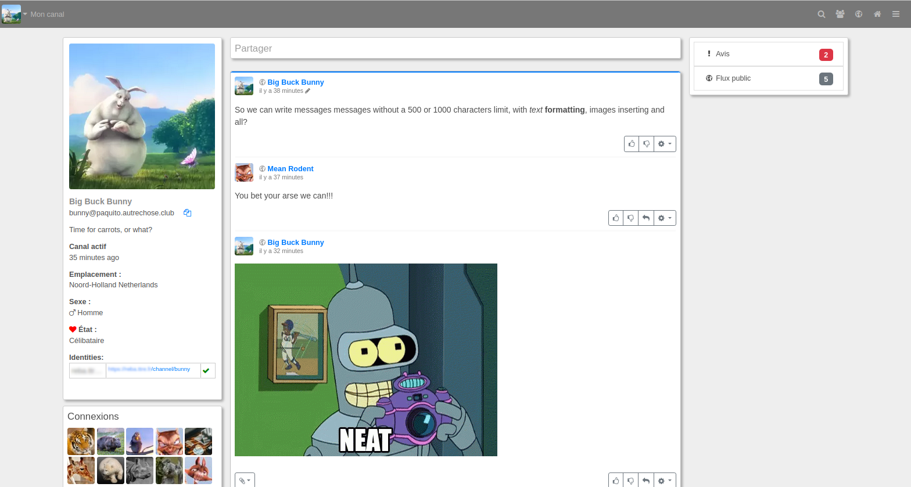

<!--
Важно: этот README был автоматически сгенерирован <https://github.com/YunoHost/apps/tree/master/tools/readme_generator>
Он НЕ ДОЛЖЕН редактироваться вручную.
-->

# Streams для YunoHost

[](https://ci-apps.yunohost.org/ci/apps/streams/)


[](https://install-app.yunohost.org/?app=streams)

*[Прочтите этот README на других языках.](./ALL_README.md)*

> *Этот пакет позволяет Вам установить Streams быстро и просто на YunoHost-сервер.*  
> *Если у Вас нет YunoHost, пожалуйста, посмотрите [инструкцию](https://yunohost.org/install), чтобы узнать, как установить его.*

## Обзор

The [streams repository](https://codeberg.org/streams/streams/) lets you install fediverse-connected websites with powerful and innovative features such as decentralized/nomadic identity, permissions framework, and much more (see [FEATURES](doc/FEATURES.md)).

Your websites will be compatible with **Mastodon**, **Pleroma**, **Pixelfed**, **Friendica**, **Hubzilla**, **Funkwhale**, **Peertube**, **Plume**, **WriteFreely** and many, many more.


**Поставляемая версия:** 25.2.14~ynh1

## Снимки экрана



## Документация и ресурсы

- Репозиторий кода главной ветки приложения: <https://codeberg.org/streams/streams>
- Магазин YunoHost: <https://apps.yunohost.org/app/streams>
- Сообщите об ошибке: <https://github.com/YunoHost-Apps/streams_ynh/issues>

## Информация для разработчиков

Пришлите Ваш запрос на слияние в [ветку `testing`](https://github.com/YunoHost-Apps/streams_ynh/tree/testing).

Чтобы попробовать ветку `testing`, пожалуйста, сделайте что-то вроде этого:

```bash
sudo yunohost app install https://github.com/YunoHost-Apps/streams_ynh/tree/testing --debug
или
sudo yunohost app upgrade streams -u https://github.com/YunoHost-Apps/streams_ynh/tree/testing --debug
```

**Больше информации о пакетировании приложений:** <https://yunohost.org/packaging_apps>
